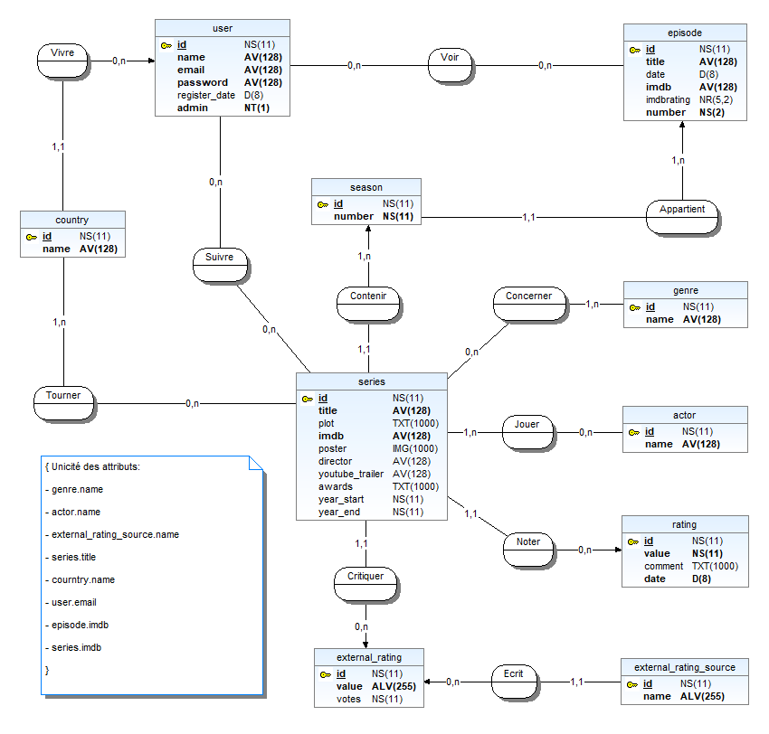

# Documentation de la base de données

Ce document a pour objectif d'assurer une meilleure compréhension de la base grâce à une description conceptuelle des données.

## Contexte

Cette base de données est utilisée dans le cadre d'un projet de conception d'une web-app. Dans cette web-app, la base servira à enregistrer de nouveaux utilisateurs, de nouvelles séries, ou encore à stocker les séries vues et suivies par ces utilisateurs.

Voici le schéma MCD de la base :

## Description des tables

- ### Table *actor*
    
    Cette table sert à stocker des informations sur les différents acteurs.

    _**Attributs :**_
        
    - **id**: l'identifiant de la table. _**(int)**_
    - **name**: nom de l'acteur. _**(varchar)**_

    _**Contraintes :**_
        
    - **id** : clé primaire. _**(int)**_
    - Unicité de **actor.name**.
    - Tous les attributs sont obligatoires.
  
    ---

- ### Table *actor_series*
    
    Cette table est une table d'association pour établir une relation many-to-many entre des acteurs et des series.

    _**Attributs :**_
        
    - **actor_id** : identifiant de l'acteur. _**(int)**_
    - **series_id** : identifiant de la serie. _**(int)**_
        
    _**Contraintes :**_

    - **actor_id** : clé étrangère faisant réfèrence à _**actor.id**_.
    - **series_id** : clé étrangère faisant réfèrence à _**series.id**_.
    - Unicité du couple (**acotor_id**,**series_id**)
    - Tous les attributs sont obligatoires.
  
    ---

- ### Table *country*
    
     Cette table sert à stocker des informations sur les différents pays.

    _**Attributs :**_
        
    - **id** : identifiant de la table. _**(int)**_
    - **name** : nom du pays. _**(varchar)**_

    _**Contraintes :**_
        
    - **id** : clé primaire.
    - Unicité de l'attribut **name**.
    - Tous les attributs sont obligatoires.

    ---
  
- ### Table *country_series*

    Cette table est une table d'association pour établir une relation many-to-many entre des séries et des pays.

    _**Attributs :**_
        
    - **country_id** : identifiant du pays. _**(int)**_
    - **series_id** : identifiant de la serie. _**(int)**_
        
    _**Contraintes :**_

    - **country_id** : clé étrangère faisant référence à _**country.id**_.
    - **series_id** : clé étrangère faisant référence à _**series.id**_.
    - Unicité du couple (**country_id**,**series_id**)
    - Tous les attributs sont obligatoires.

    --- 

- ### Table *episode*

    Cette table sert à stocker des informations sur les différents épisodes des séries.

    _**Attributs :**_
        
    - **id** : identifiant de la table. _**(int)**_
    - **season_id** : identifiant de la saison à laquelle l'épisode appartient._**(int)**_
    - **title** : titre de l'épisode. _**(varchar)**_
    - **date** : date de l'épisode. _**(date)**_
    - **imdb** : identifiant IMDb de l'épisode. _**(varchar)**_
    - **imdbrating** : note IMDb de l'épisode. _**(double)**_
    - **number** : numéro de l'épisode dans la saison. _**(int)**_
        
    _**Contraintes :**_

    - **id** : clé primaire.
    - **season_id** : clé étrangère faisant référence à _**season.id**_
    - Unicité de l'attribut **imdb**.
    - Tous les attributs sont obligatoires sauf **date** et **imdbrating**.

    #### Note :
    L'attribut _**imdb**_ fait référence à Internet Movie Database (IMDb), une base de données en ligne regroupant des informations sur les films, émissions de télévision, séries, jeux vidéo et professionnels de l'industrie cinématographique.

    ---

- ### Table *external_rating*

    Cette table sert à stocker des évaluations externes ou des notations associées à des séries dans une base de données.

    _**Attributs :**_
        
    - **id** : identifiant de la table. _**(int)**_
    - **series_id** : identifiant de la série à laquelle l'évaluation appartient. _**(int)**_
    - **source_id** : identifiant de la source de l'évaluation. _**(int)**_
    - **value** : valeur de l'évaluation. _**(varchar)**_
    - **votes** : nombre de votes associés à l'évaluation. _**(int)**_
        
    _**Contraintes :**_

    - **id** : clé primaire.
    - **series_id** : clé étrangère faisant référence à _**series.id**_.
    - **source_id** : clé étrangère faisant référence à _**external_rating_source.id**_.
    - Tous les attributs sont obligatoires sauf _**votes**_.

    ---

- ### Table *external_rating_source*

    Cette table sert à stocker des informations sur les différentes sources externes qui fournissent des évaluations pour les séries.

    _**Attributs :**_
        
    - **id** : identifiant de la table. _**(int)**_
    - **name** : nom de la source. _**(varchar)**_
        
    _**Contraintes :**_

    - **id** : clé primaire.
    - Unicité de l'attribut **name**.
    - Tous les attributs sont obligatoires.
  
    ---

- ### Table *genre*

    Cette table stocke des informations sur les différents genres associés aux séries.

    _**Attributs :**_
        
    - **id** : identifiant de la table. _**(int)**_
    - **name** : nom du genre. _**(varchar)**_
        
    _**Contraintes :**_

    - **id** : clé primaire.
    - Unicité de l'attribut **name**.
    - Tous les attributs sont obligatoires.
    
    ---

- ### Table _**genre_series**_

    Cette table est une table d'association pour établir une relation many-to-many entre les series et leurs genres.

    _**Attributs :**_

    - **genre_id** : identifiant du genre. _**(int)**_
    - **series_id** : identifiant de la serie. _**(int)**_

    _**Contraintes :**_

    - **genre_id** : clé étrangère référençant **genre.id**.
    - **series_id** : clé étrangère référençant **series.id**
    - Unicité du couple (**genre_id**,**series_id**)
    - Tous les attributs sont obligatoires.
  
    ---

- ### Table *rating*

    Cette table enregistre les évaluations données par les utilisateurs aux séries.

    _**Attributs :**_
        
    - **id** : identifiant de la table. _**(int)**_
    - **series_id** : identifiant de la série évaluée. _**(int)**_
    - **user_id** : identifiant de l'utilisateur qui a donné  _**(int)**_l'évaluation.
    - **value** : valeur de l'évaluation attribuée à la série. _**(int)**_
    - **comment** : commentaire associé à l'évaluation. _**(longtext)**_
    - **date** : date à laquelle l'évaluation a été donnée. _**(datetime)**_

    _**Contraintes :**_

    - **id** : clé primaire.
    - **series_id** : clé étrangère faisant référence à _**series.id**_.
    - **user_id** : clé étrangère faisant référence à _**user.id**_.
    - Tous les attributs sont obligatoires sauf **comment**.

    ---

- ### Table *season*

    Cette table enregistre des informations sur les saisons associées aux séries.

    _**Attributs :**_
        
    - **id** : identifiant de la saison. _**(int)**_
    - **series_id** : identifiant de la série à laquelle la saison appartient. _**(int)**_
    - **number** : numéro de la saison dans la série. _**(int)**_

    _**Contraintes :**_

    - **id** : clé primaire.
    - **series_id** : clé étrangère faisant référence à _**series.id**_.
    - Tous les attributs sont obligatoires.

    ---

- ### Table *series*

    Cette table stocke des informations sur les différentes séries de l'application.

    _**Attributs :**_
        
    - **id** : identifiant de la série. _**(int)**_
    - **title** : nom de la série. _**(varchar)**_
    - **plot** : intrigue de la série. _**(longtext)**_
    - **imdb** : identifiant IMDb de la série. _**(varchar)**_ [note](#note)
    - **poster** : affiche de la série. _**(longblob)**_
    - **director** : réalisateur de la série. _**(varchar)**_
    - **youtube_trailer** : vidéo du trailer. _**(varchar)**_
    - **awards** : récompenses de la série. _**(longtext)**_
    - **year_start** : date de début de la série. _**(int)**_
    - **year_end** : date de fin de la série. _**(int)**_

    _**Contraintes :**_

    - **id** : clé primaire.
    - L'attribut **year_start** < **year_end**
    - Unicité des attributs **title**, **imdb**, **poster**, **youtube_trailer**.
    - Les attributs obligatoires sont **id**, **title**, **imdb**.

    ---

- ### Table *user*  

    Cette table stocke des informations sur les utilisateurs de l'application.

    _**Attributs :**_

    - **id** : identifiant de la table. _**(int)**_
    - **name** : nom de l'utilisateur. _**(varchar)**_
    - **email** : email valide de l'utilisateur. _**(varchar)**_
    - **password** : mot de passe chiffré de l'utilisateur. _**(varchar)**_
    - **register_date** : date de création du compte. _**(datetime)**_
    - **admin** : 1 si l'utilisateur est admin sinon 0. _**(tinyint)**_
    - **country_id** : identifiant du pays de l'utilisateur. _**(int)**_
    
    _**Contraintes :**_

    - **id** : clé primaire.
    - Unicité de l'attribut **email**.
    - **country_id** : clé étrangère référençant **country.id**
    - Tous les attributs sont obligatoires sauf **register_date** et **country_id**.
  
    ---

- ### Table _**user_episode**_

    Cette table est une table d'association pour établir une relation many-to-many entre les utilisateurs et les épisodes qu'ils suivent.

    _**Attributs :**_

    - **user_id** : identifiant de l'utilisateur. _**(int)**_
    - **episode_id** : identifiant de l'épisode. _**(int)**_

    _**Contraintes :**_

    - **user_id** : clé étrangère référençant **user.id**.
    - **episode_id** : clé étrangère référençant **episode.id**
    - Unicité du couple (**user_id**,**episode_id**)
    - Tous les attributs sont obligatoires.

    ---

- ### Table _**user_series**_

    Cette table est une table d'association pour établir une relation many-to-many entre les utilisateurs et les series qu'ils suivent.

    _**Attributs :**_

    - **user_id** : identifiant de l'utilisateur. _**(int)**_
    - **series_id** : identifiant de la serie. _**(int)**_

    _**Contraintes :**_

    - **user_id** : clé étrangère référençant **user.id**.
    - **series_id** : clé étrangère référençant **series.id**
    - Unicité du couple (**user_id**,**series_id**)
    - Tous les attributs sont obligatoires.

